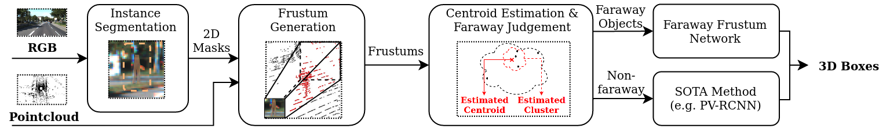

# faraway-frustum
Faraway-Frustum: Dealing with LiDAR Sparsity for 3D Object Detection using Fusion

<p align="center">

</p>

Paper in ArXiv: https://arxiv.org/abs/2011.01404

Submitted to ICAR 2021.

## Environment
There two scripts for running this program. Each script requires a different version of `tensorflow`. Check the python script files for version detail. 

We recommend to use `anaconda` to manage the tensorflow environment. You can use the following commands to configure your environment:
```shell
conda create -n {your environment name} tensorflow-gpu={a specific version} python=3.7
```
Then `anaconda` will solve the dependencies automatically for you. (Make sure you have successfully installed the NVIDIA driver.)

You also need to install the additional standard python packages listed in `requirements.txt`.

## Getting Started

Note: there are additional instructions inside the python scripts of step 1 and step 2. Do check them. 

1. Download the pre-trained Mask-RCNN model 
([link](https://drive.google.com/file/d/1QsfRE5NV6a9aCs6SG0LEklmOS9at2EFK/view?usp=sharing)) 
and put it into folder `detectors/mask_rcnn/`.

2. Prepare Kitti Dataset: download [Kitti Dataset](http://www.cvlibs.net/datasets/kitti/) and arrange it as follows.
   In Kitti, `training` has 7481 samples and `testing` has 7518 samples.
    ```shell script
    ├── testing
    │   ├── calib
    │   ├── image_2
    │   └── velodyne
    └── training
        ├── calib
        ├── image_2
        ├── label_2
        └── velodyne
    ```

3. Run stage one of 2D detection nd save results: execute the script `step1_save_2d_results.py` to obtain 
the 2D detection result (including boxes, masks, labels, scores). It will be saved as pickle file.
You need to specify the path to Kitti dataset `--path_kitti` and the path to store the 2D detection results 
`--path_result`.

4. Download the trained NN models for pedestrian/car position detection/refinement in the frustum pointcloud.
Here is the link to download the models: [NN models - Google Drive](https://drive.google.com/file/d/1_BdfX87hUUXLlytWfNxYeOD-qpmGvZmc/view?usp=sharing)

5. Run stage two of frustum-projection and 3D box estimation: execute the script `step2_get_kitti_results.py` 
to obtain the final results of Kitti txt format. It will read the pickle files obtained in previous step and 
generating final results in the same directory. Again, you need to specify the path to Kitti dataset `--path_kitti` 
and the path to store the 2D detection results `--path_result`. They should be the same as in the previous 
step. You also need to specify the path to trained NN models. See additional instruction in the `step2_get_kitti_results.py`.

## Calculating Detection Results

We provide the code to calculate the detection results in the paper. All the code for result calculation can be found in the `evaluation` folder, and the code are based on both C/C++ and Python.   

We also provide the TXT files of both ground truth labels and detection results of our method (on validation set). You can use them in `result` folder for evaluation test:     

1. Files in `result\label\val` are from the ground truth labels on the validation subset of KITTI dataset.    

2. Files in `result\ours_pedestrian` are pedestrian detection results on the validation subset of our method.  
(`box\val` and `mask\val` represent our model using box-frustum and mask-frustum respectively, which is same for car results below)    

3. Files in `result\ours_car`are car detection results on the validation subset of our method.  

There are 3 types of evaluation results, which can be obtained as explained below:  

### Average IoU for BEV detection of faraway objects:

1. Open `average_iou.py` and do:  
   Give the correct PATH (e.g `.\result\ours_pedestrian\mask\val`) to your detection result files and the PATH (e.g `.\result\label\val`) to the corresponding label files  in `line 157-160`.  
   Define the class (`1` for pedestrian and `0` for car) in `line 171`.  

2. Run `average_iou.py` and get results.  

### mAP for faraway objects:

1. Open `data_process.py` to process raw detection result files and corresponding KITTI label files:   
   Give the PATH (e.g `.\result\ours_pedestrian\mask\val`) to detection result files (e.g 000000.txt ...) and the PATH (e.g `.\result\label\val`) to     corresponding KITTI label files (e.g 000000.txt ...) in `line 455-456` and `line 464-465`.    
   Give `fuction='eval_sub'` in `line 404` and then run the code to extract the sequential detection result files (and sequential label files) for faraway objects.    

2. Open `mAP_toolkit/cpp/evaluate_object.cpp` and revise following lines: change the number (e.g.3756) in `line 35` to the max number of the sequential result files (e.g. if you have following result(label) files: 000000.txt,...,000057.txt, you will change the number to 57).    
   Use `line 44-46` and comment out `line 48-50`.    
   Use `line 61` and change the IoU threshold, and comment out `line 60`.    
   Change `line 783-784` to your own root PATH.    

3. Compile the `mAP_toolkit/cpp/evaluate_object.cpp`:     
   Use `g++ -O3 -DNDEBUG -o test evaluate_object.cpp`   
   or use `CMake` and the provided `'CMakeLists.txt'`.    

4. Give files for evaluation:    
   Copy your sequential label files to `.../cpp/label_2/`.    
   Copy your sequential detection result files to `.../cpp/results/dt/data/`.    

5. Run the compiled C++ file:   
   Open the Terminal Window in `/cpp` and run as follow: `./test dt`.    

6. Calculate the mAP for faraway objects:    
   Run `.../cpp/calculate_mAP_faraway.py` to print final mAP for 3D/BEV faraway object detection.    

### Kitti offical mAP (easy, mod, hard):

1. Open `data_process.py` to process raw detection result files and corresponding KITTI label files:    
   Give the PATH to our raw detection result files (e.g 000000.txt ...) and the PATH to state-of-the-art detector's results (e.g 000000.txt ...) in `line 417-418`.  
   Give `fuction='fuse_result'` in `line 404`  and then run the code to generate our detection result files by fusing our faraway object results with state-of-the-art detector's results.  
   Give the PATH (e.g `.\result\ours_pedestrian\mask\val`) to our detection result files (or PATH (e.g `.\result\label\val`) to corresponding KITTI label files) in `line 435-436`.  
   Give `fuction='eval_val'` in `line 404` and then run the code to change the detection result files (or label files) to sequential result files (or sequential label files).  

2. Open `mAP_toolkit/cpp/evaluate_object.cpp` and revise following lines: change the number (e.g.3756) in `line 35` to the max number of the sequential result files (e.g. if you have following result(label) files: 000000.txt,...,000057.txt, you will change the number to 57).  
   Use `line 48-50` and comment out `line 44-46`.  
   Use `line 60` and and comment out `line 61`.  
   Change `line 783-784` to your own root PATH.  

3. Compile the `mAP_toolkit/cpp/evaluate_object.cpp`:   
   Use `g++ -O3 -DNDEBUG -o test evaluate_object.cpp` or use `CMake` and the provided `'CMakeLists.txt'`.  

4. Give files for evaluation:  
   Copy your sequential label files to `.../cpp/label_2/`.  
   Copy your sequential detection result files to `.../cpp/results/dt/data/`.  

5. Run the compiled C++ file:  
   Open the Terminal Window in `/cpp` and run as following: `./test dt`.  

6. Calculate the mAP for faraway objects:  
   Run `.../cpp/calculate_mAP.py` to print final mAP (easy, mod, hard) for 3D/BEV object detection.  

## Contact

- Dongfang Yang: yang.3455@osu.edu
- Haolin Zhang: zhang.10749@osu.edu
- Ekim Yurtsever: yurtsever.2@osu.edu
